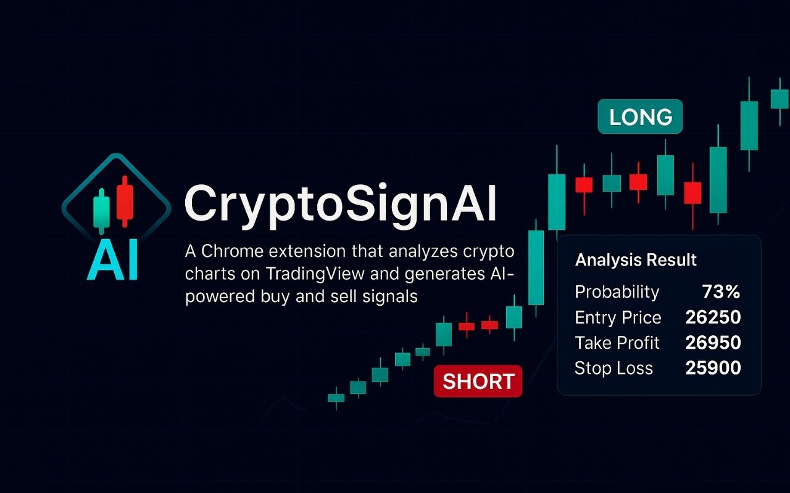

# CryptoSignAI — AI Trading Signals for TradingView

**One-click AI trading analysis, right on top of your TradingView charts.**

## Overview

CryptoSignAI is a Chrome extension that turns any TradingView chart into an AI trading assistant. It reads the live chart, pairs it with real-time market data from Binance, and asks an LLM to produce a directional call — **long or short** — complete with an entry price, take-profit, stop-loss and a confidence score.

## Features

- 📈 **One-click chart analysis** — captures the active TradingView chart and market context automatically
- 🤖 **Multi-provider AI** — Gemini, ChatGPT and free LLM fallbacks via OpenRouter / LLM7
- 🎯 **Actionable signals** — entry, take-profit, stop-loss and probability, not just a direction
- 🔎 **Automatic pair detection** — recognizes the traded symbol across major exchanges
- 🕘 **Signal history** — every analysis is saved and can be revisited later
- 🌍 **Localized UI** — English, Turkish, German, French, Spanish, Russian, Chinese, Japanese, Arabic, Portuguese

## Tech Stack

Chrome Extension (Manifest V3) · JavaScript · Binance Market Data API · Gemini / OpenRouter LLM APIs

## About this repository

This is a public showcase of the project. The implementation (`core`) is kept in a private repository and linked here as a submodule, available on request.

---

Built by [@h-kod](https://github.com/h-kod)

